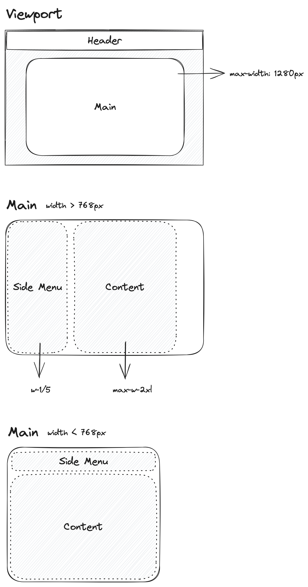

> A simplistic online social profile app, augmented with AI and Blockchain.

<!-- make a gif, to showcase the UI -->

## Blocklet Server

### 安装

文档：https://developer.blocklet.io/docs/install-blocklet-cli

不支持用 `bun` 安装，会导致 sqlite3 相关的报错。

### 新建

`blocklet server init`，本地开发时可以加个选项 `--mode=debug`

### 启动

`blocklet server start`

Blocklet 本地开发环境依赖于 Blocklet server。

[本地 dashboard 链接](http://192.168.0.242/.well-known/server/admin/)

### 关闭

`blocklet server stop`

## Blocklet

### 新建

`blocklet create` 选择模版新建一个 Blocklet App。

`pnpm i` 安装初始依赖。

### 开发

`blocklet dev` 启动本地热加载开发环境。

### 打包

`pnpm bundle`

打包后产生两个文件夹：

- `.blocklet/bundle`：用于部署
- `.blocklet/release`：用于发布到应用市场

### 部署

1. 在 Blocklet Server 的控制台新建一个 Blocklet App
2. 记下 Blocklet App 的 DID 地址，填入 `package.json` 的 `app-id` 字段
3. `pnpm deploy` 进行部署

vCard 的 DID：`zNKcJDvG6v6JFwhz5PjXH9BogSkqx4rynmoL`

注意：Blocklet 是一个组件，Blocklet Application 才是独立的完整应用，详见[文档](https://developer.blocklet.io/docs/zh/885b49e7-8ea8-4877-997e-c163d1c5d669)。

## 初始配置

1. 增加 `jsconfig.json` 配置文件，方便 `import` 时引用根目录。详见[文档](https://nextjs.org/docs/app/building-your-application/configuring/absolute-imports-and-module-aliases)
2. 配置 TailwindCSS，详见[文档](https://tailwindcss.com/docs/guides/nextjs)
3. 更新 Next.js 至最新版 `pnpm add next@latest react@latest react-dom@latest`
4. 删除 `pages` 文件夹，新建 `app` 文件夹，以及 `components` 文件夹
5. 在 layout.js 中添加 suppressHydrationWarning，避免浏览器插件导致的报错

## 场景构思（模拟）

### 一句话产品定位

vCard 是一个简洁的在线名片，Web3 爱好者可以维护一个专属于自己的 profile，用它来方便别人了解自己、联系自己。

slogan: Use vCard to enhance your online presence

### 内容设计

根据使用场景，vCard 可能包含以下几部分内容：

- 名字：名字可以是真名或昵称，系统不作限制。需要支持 emoji。
- 头像：为了方便编辑，可以留存历史上传的照片。需要支持随时调整（尺寸、裁切位置）、或更新头像。
- 简介：纯文本框。需要支持 emoji；如时间允许可以考虑支持 markdown。由于简介比较长，可以引入 AI 为用户检查语法错、帮助文案构思、补充内容等。
- 地址：当前所在位置（国家）。
- 生日（待定）
- 工作状态：远程办公 / 现场办公 / 正在看新机会
- 联系方式：手机和邮箱。可以勾选控制是否对大众可见。提交前需要通过验证。手机前缀为国家电话编码，跨国通话、或发送验证短信时会用到。
- 社交帐户链接：支持几个流行社交网络平台，例如：LinkedIn, GitHub, Instagram, Twitter。

使用该应用创建自己的名片前，需要个人钱包绑定登录（该项目省略），每一次的在线行为，例如：修改资料、发表内容、与别人互动，都会被记录，且被 mint 成为一个个 NFT。

## 功能开发

### 数据库

命名约定：表名用复数，列名用下划线相连。当引用其他表的 ID 时，使用单数的表名，例如：avatar_id，profile_id

#### countries 表

- id 主键
- name 国家名 TEXT
- country_calling_code 国家电话编码 TEXT

注意：存在两个国家用同一编码的情况，例如：加拿大和美国，都是 (+1)。

#### avatars 表

- id 主键
- profile_id 头像所属 profile INTEGER
- avatar 图片 BLOB

#### profiles 表

- id 主键
- name 展示名 TEXT
- handle 用户唯一 ID TEXT
- about 简介 TEXT
- birth_date 生日 TEXT
- location_country 所在地 TEXT
- working_status 工作状态 TEXT
- phone 手机号 TEXT
- country_calling_code 国家电话编码 TEXT（号码归属地未必与所在地相同）
- phone_is_public 手机号公开与否 INTEGER
- email 邮箱 TEXT
- email_is_public 邮箱公开与否 INTEGER
- linkedin_user_id TEXT
- github_user_id TEXT
- twitter_user_id TEXT
- instagram_user_id TEXT
- avatar_id 头像 ID BLOB（当前在用头像的指针）
- created_at 加入时间 TIMESTAMP
- updated_at 更新时间 TIMESTAMP

时间格式：YYYY-MM-DD HH:MM:SS
日期格式：YYYY-MM-DD

注意：数据库中只存储可读的时间或日期格式，需要运算时由后端代码换算成值。

#### nfts 表

用区块链强化线上社交行为的可信度和意义。思路类似 [Lens: The social layer for Web3](https://www.lens.xyz/)。

- id 主键
- profile_id 外键 INTEGER
- hash 唯一哈希值 TEXT
- transaction_id 智能合约公证记录 TEXT
- log 交互记录 JSON（包括修改 profile，给 profile 评论点赞等）
- created_at 创建时间 TIMESTAMP

思考：头像图片并不大，在前端做了压缩和文件大小检验的情况下，直接用数据库存储不会带来性能问题，反而能和其他数据一并发给前端，减少网络延迟。

注意：user_id 会用于生成可分享的链接，必须是唯一的，但是也允许修改（不可过于频繁，10 秒冷却时间）。

#### 格式细节说明

手机号由两部分做成，国家电话编码最多 3 位，手机号总共最多 15 位（含国家电话编码）

> The specification divides the digit string into a country code of one to three digits, and the subscriber telephone number of a maximum of twelve digits.

https://en.m.wikipedia.org/wiki/E.164
https://en.m.wikipedia.org/wiki/List_of_country_calling_codes

记录「公开与否」的这类 flag 值本应用 Bool 记录，但是 Cloudflare Worker D1 不支持，改用数字 0 或 1 替代（1 代表公开）。

社交帐户只记录用户 id，在前端拼成完整的 URL。

生日、所在地、工作状态等字段用 TEXT 保存，后端不作强校验，前端校验格式和允许的值范围即可。

### 路由

| route      | decription                           |
| ---------- | ------------------------------------ |
| /          | 落地页（首页）                       |
| /buweiliao | 展示 `user_id` 为 `buweiliao` 的名片 |
| /new       | 新建名片                             |
| /discover  | 浏览平台中其他人的名片               |


名片页既用于展示，也承担编辑功能（该用户已登录且是他本人名片的情况下），不需要跳转。

### 缓存管理

用 `revalidateTag` 清缓存。原则是非必要就别清除缓存。清缓存时机：

1. 更新名片成功：如果 `user_id` 不变，提交成功就清除缓存；如果 `user_id` 也变了，那么在访问新的名片页面时在 `db.js` 里清除缓存。因为 `user_id` 被用于作为名片页面链接的一部分，如果马上清缓存会导致当前页面无法显示。
2. 更新名片失败：也要马上清除缓存，因为失败的 response 也会被缓存下来。如不清除，即使下次更新成功了，仍然会显示上一次失败的结果。

## UI 设计

### 响应式布局

- Main 区域居中
- 限制 Main 区域最宽为 1280px (xl)
- 当 Main 区域小于 768px (md) 时，使用纵向布局
- 当 Main 区域更大时，横向布局



## Cloudflare Worker

`pnpm create cloudflare@latest` 新建一个 Cloudflare Worker，与数据库直接交互，为前端提供数据 API 服务。

- `/api/profile/:user_id (GET)`：取出 profile 所有字段，包括头像。
- `/api/profile/:user_id (POST)`：更新 profile，忽略值为 null 的字段。
- `/api/avatar/:user_id (GET)`：取出单个头像。
- `/api/avatar/:user_id (POST)`：更新单个头像。
- `/api/avatars/:user_id`：取出最近使用的头像（最多 5 个）
- `/api/countries`：取出所有国家的信息。
- `/api/check/user/:user_id`：检查某个 User ID 是否已经被占用了，占用则不能使用该 ID。

| API endpoint          | method | description                       |
| --------------------- | ------ | --------------------------------- |
| /api                  | GET    | all available API endpoints       |
| /api/profile/:user_id | GET    | get user's profile                |
| /api/profile          | POST   | update user profile (id required) |
| /api/avatar/:user_id  | GET    | get current avatar                |
| /api/avatars/:user_id | GET    | get recent avatars (5)            |
| /api/countries        | GET    | get a list of all countries       |
| /api/claim/:user_id   | POST   | check if a user id is vacant      |
| /api/nfts/:user_id    | GET    | get NFTs                          |

查看所有目前可用的 API 端点：[vcard.buweiliao.workers.dev/api](https://vcard.buweiliao.workers.dev/api?pretty)

### 数据库 Binding

于 `wrangler.toml` 中增加绑定：

```
[[d1_databases]]
binding = "DB"
database_name = "vcard"
database_id = "d8a159bd-5b28-4171-81d8-8799a069abab"
```

### Schema 文件

```
drop table if exists "profiles";

create table "profiles" (
  "id" integer primary key autoincrement,
  "name" text not null,
  "user_id" text not null,
  "created_at" datetime default current_timestamp,
  "updated_at" datetime default current_timestamp
);

insert into "profiles" ("name", "user_id") values ('Super Pro', 'demo');
```

关注 wrangler dev 运行时的报错 "Error: D1_ERROR: no such table: users"，为与数据库相关错误。

### 前后端约定

给每个 API 请求返回结果，返回格式：

```
{
  status: 'error' | 'success',
  message: 'error message or success message',
  result: OBJECT
}
```

如果遇到 error 时，result 可以缺失。成功情况必须返回 result，且一定是一个 JavaScript Object。

### 数据格式校验（在更新 DB 表时）

前端校验：

- char set：仅使用了指定字符集
- [5-20]：长度在 5 ～ 20 之间，开区间

后端校验：

- unique：表中没有同样值的行
- cool down：操作频繁遇到的强制冷却时间已经过去

| fields         | format in DB | nullable | Backend     | Frontend         |
| -------------- | ------------ | -------- | ----------- | ---------------- |
| **id**         | INTEGER      |          |             |                  |
| **name**       | TEXT         | not null |             | [5-20], char set |
| **user_id**    | TEXT         | not null | unique      |                  |
| **updated_at** | DATETIME     |          | cooled down |                  |

注意：为了降低理解成本，提升反应速度，统一用积极的口吻表达校验规则。不关注的字段不作标注，例如：id 不会被修改、updated_at 是自动生成的。

## 其他

### 文件组织

- public/ - static files
  - favicon.ico - favicon
- screenshots/ - Screenshots
- api/ - Api side code
  - hooks/ - blocklet lifecycle hooks
  - libs/ - Api side libraries
  - middlewares/ - Api side middlewares
  - routes/ - Api side routes
  - index.js - Api side entry point
- pages/ - next.js pages folder
- styles/ - next.js styles folder
- .env - Environment variables
- .env.local - Local environment variables
- .eslintrc.js - ESLint configuration
- .gitignore - Git ignore file
- .prettierrc - Prettier configuration
- blocklet.md - Blocklet README
- blocklet.yml - Blocklet configuration
- LICENSE - License file
- logo.png - Blocklet logo file
- Makefile - Makefile
- next.config.js - next.js config file
- package.json - Npm package file
- README.md - A guide for this blocklet
- version - Version file

### 部署

部署到远程 Blocklet Server：

```shell
blocklet deploy .blocklet/bundle --endpoint {your blocklet server url} --access-key {blocklet server access key} --access-secret {blocklet server access secret}
```

### 文档

- Full specification of `blocklet.yml`: [https://github.com/blocklet/blocklet-specification/blob/main/docs/meta.md](https://github.com/blocklet/blocklet-specification/blob/main/docs/meta.md)
- Full document of Blocklet Server & blocklet development: [https://developer.blocklet.io/docs/en](https://developer.blocklet.io/docs/en)

## 总结

虽然是一个 3 天不到的小项目，但在实现过程中着重考虑了：

1. 使用场景：即便是虚构，也应该基于现实世界可能发生的 use case 进行延伸。
2. AI 和区块链：二者都是新一代的重要基础设施，未来会更加普遍、被运用得越来越广泛。每个应用都能通过它们得到方方面面的强化，例如提升效率、降低使用成本、保护隐私、信息安全、内容可信度等等。
3. 代码抽象：小到数据库表名、变量名、返回值格式、代码注释格式，大到项目代码文件组织和命名，都为易读性、开发效率和后期维护的简便而服务。
4. 前后端分离：本项目中数据 API 用 Cloudflare Worker 实现，Next.js 虽然是全栈框架，但只在它的后端调用 Worker 提供的 API、以及提前渲染页面（SSR）发给前端展示。这样能把所有与 UI 无关的逻辑都通过 API 来交互，数据 API 可以是 Cloudflare Worker，也可以是 AWS Lamda，或者其他部署在云上的可并发的微服务。
5. 用户体验：快速高效地产出功能不是唯一目标，还要考虑界面美观、交互友好、流程顺畅、文案易懂。
6. 工作流程：即使是独立完成，也会产出代码、测试用例、设计文件等各个交付物，而不是一锅乱炖。

这个作品可以体现我在产品构思、编程、UI 设计的深厚积累，以及对 AI 和区块链应用的热情。唯一缺憾是没有用 TypeScript 做强类型检查。
